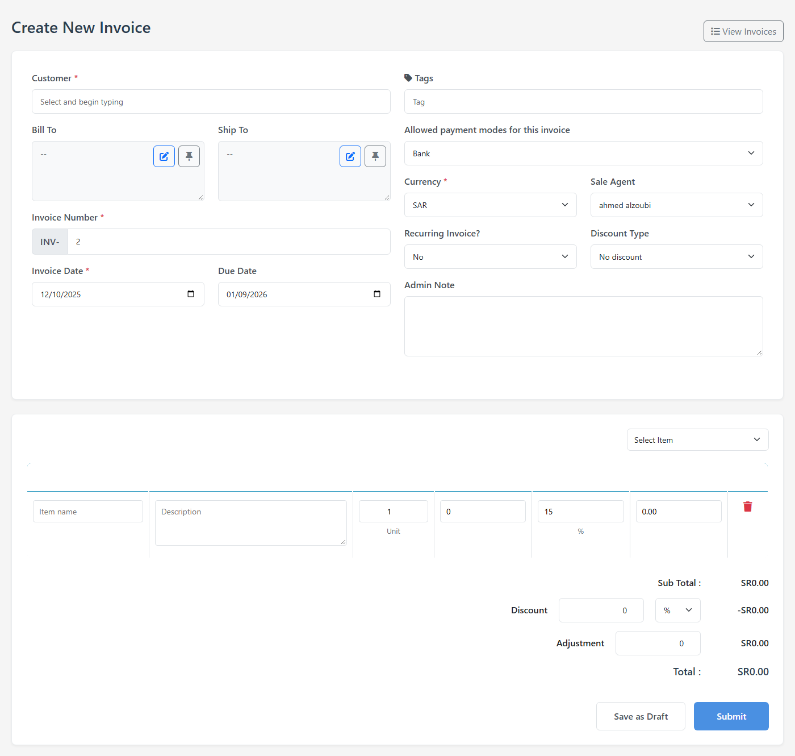
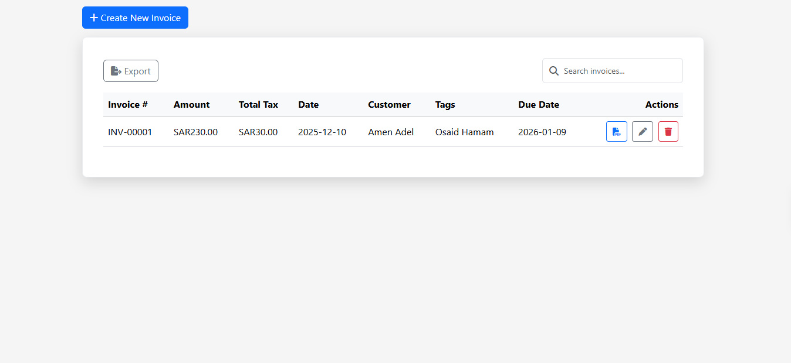
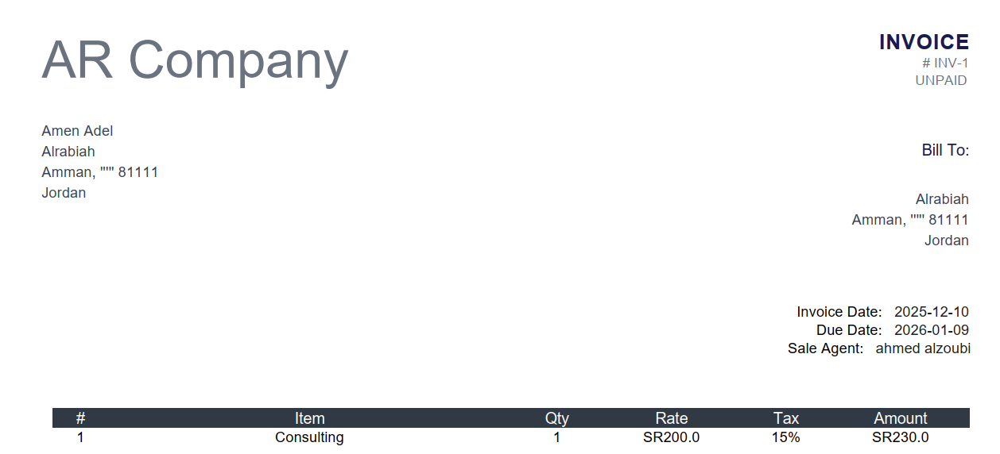

# Invoice Sales Management System

A PHP MVC invoice management system for creating, viewing, editing, and deleting sales invoices, managing products and invoice items, and generating PDF invoices, with search, CSV export, and a modern Bootstrap interface.

## Screenshots

### Create Invoice



### Invoices List



### Invoice PDF



## Features

- Create and manage sales invoices with customer, billing, and shipping details
- Add and manage invoice items and products with quantity, rate, and tax
- View and list invoices with live search
- Edit and delete invoices
- Generate PDF invoices
- Export invoices to CSV
- Automatic totals, discount, tax, and adjustment calculations
- MySQL database integration with automatic table setup
- AJAX-based client/server communication
- MVC-based PHP structure with service layer for business logic

## Technologies

- PHP
- MySQL
- JavaScript
- AJAX
- HTML
- CSS
- Bootstrap
- Font Awesome
- Composer
- TCPDF

## Project Structure

```text
Controllers/
Core/
Models/
views/
screenshots/
InvoiceService.php
api.php
index.php
invoices.php
invoice_pdf.php
app.js
script.js
style.css
composer.json
```

## Installation

1. Clone the repository:

   ```bash
   git clone https://github.com/Ahmed-Alzoubi-az9/Invoice-Sales.git
   ```

2. Install PHP dependencies:

   ```bash
   composer install
   ```

3. Create the required MySQL database and configure the database connection in `Core/Database.php`.

4. Run the project using a local PHP/Apache environment such as XAMPP.

5. Open the app via http://localhost/Inovice_Sales/index.php.

## Notes

This project was developed as a practical PHP MVC invoice management application and demonstrates CRUD operations, database integration, client-server communication, PDF generation, and basic application architecture.
